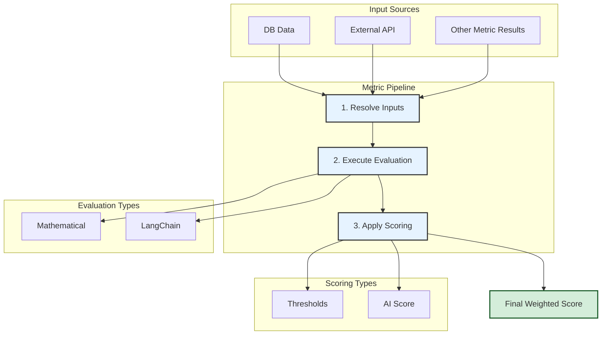

# Hybrid Financial Analysis Engine: Design Blueprint

This document outlines the architecture for a new, unified financial analysis engine. It combines deterministic mathematical calculations with advanced AI-driven analysis within a single, flexible template structure.

## Core Principle: Separation of Concerns

The system is built on a key principle: separating **what to calculate** (`evaluation`) from **how to grade it** (`scoring`). This provides maximum flexibility and reusability.

---

## I. System Pipeline Overview

The analysis for a single company is performed by a **Pipeline Runner**. This runner processes a `HybridAnalysisTemplate` which contains a list of `Metric` definitions. For each metric, it executes a three-step process:



---

## II. Template Structure Blueprint

A template is a JSON or TypeScript object that defines the entire analysis.

### **`HybridAnalysisTemplate`**

```typescript
interface HybridAnalysisTemplate {
  id: string; // e.g., "tech_v2_hybrid"
  name: string; // e.g., "Hybrid Tech Sector Analysis"
  description: string;
  metrics: Metric[]; // The array of evaluation metrics
}
```

### **The `Metric` Object**

This is the core of the blueprint. Each metric is a self-contained unit of analysis.

```typescript
interface Metric {
  id: string;
  name: string;
  weight: number; // Its contribution to the final score (0.0 to 1.0)
  inputs: InputRequirement[];
  evaluation: EvaluationStep;
  scoring: ScoringStep;
}
```

---

### **Step 1: The `inputs` Block**

This array declares all data needed for the metric to run. It supports dependencies on other metrics, creating a Directed Acyclic Graph (DAG) that the pipeline runner must follow.

**`InputRequirement` Structure:**

```typescript
interface InputRequirement {
  as: string; // The local variable name for the data in this metric
  source:
    | 'financial_statement'
    | 'sec_filing_text'
    | 'metric_result'
    | 'external_api';
  // Additional fields depend on the source
  // e.g., { source: 'financial_statement', field: 'revenue', period: 'latest_year' }
  // e.g., { source: 'metric_result', metricId: 'another_metric_id' }
}
```

---

### **Step 2: The `evaluation` Block**

This defines the logic for processing the resolved inputs. The `type` property is a switch that tells the pipeline runner which engine to use.

**`EvaluationStep` Types:**

1.  **`mathematical`**: For objective, deterministic calculations.

    ```json
    "evaluation": {
      "type": "mathematical",
      "formula": "({latest_revenue} - {previous_revenue}) / {previous_revenue}"
    }
    ```

2.  **`langchain`**: For nuanced, qualitative analysis using an AI model. This step should produce a text-based analysis, not a score.

    ```json
    "evaluation": {
      "type": "langchain",
      "prompt": "Analyze the company's competitive moat based on {market_share_data}..."
    }
    ```

3.  **`chain`**: For multi-step logic where the output of one step is the input to the next.
    ```json
    "evaluation": {
      "type": "chain",
      "steps": [
        { "id": "step1", "type": "mathematical", "formula": "..." },
        { "id": "step2", "type": "langchain", "prompt": "Given {step1}, analyze..." }
      ]
    }
    ```

---

### **Step 3: The `scoring` Block**

This block takes the result from the `evaluation` step and converts it into a final 1-100 score for the metric.

**`ScoringStep` Types:**

1.  **`threshold`**: For converting a numerical result into a score based on predefined rules.

    ```json
    "scoring": {
      "type": "threshold",
      "input": "evaluation_result", // Specifies which result to use
      "rules": [
        { "if_greater_than": 20, "score": 90 },
        { "if_greater_than": 10, "score": 70 },
        { "default_score": 50 }
      ]
    }
    ```

2.  **`ai_score_from_text`**: Uses a second, simpler AI call to assign a score to a text-based analysis from a `langchain` evaluation.
    ```json
    "scoring": {
      "type": "ai_score_from_text",
      "input": "evaluation_result",
      "prompt": "Based on the following analysis, assign a score from 1 to 100 for management effectiveness: {evaluation_result}"
    }
    ```

---

## III. Complete Example

Here is how two different metric types can coexist within the same template, following the full blueprint.

```json
{
  "id": "tech_v2_hybrid",
  "name": "Hybrid Tech Sector Analysis",
  "description": "A template using both mathematical and AI evaluation.",
  "metrics": [
    {
      "id": "debt_ratio_metric",
      "name": "Debt-to-Equity Ratio",
      "weight": 0.1,
      "inputs": [
        {
          "as": "total_debt",
          "source": "financial_statement",
          "field": "totalDebt"
        },
        {
          "as": "total_equity",
          "source": "financial_statement",
          "field": "totalEquity"
        }
      ],
      "evaluation": {
        "type": "mathematical",
        "formula": "{total_debt} / {total_equity}"
      },
      "scoring": {
        "type": "threshold",
        "rules": [
          { "if_less_than": 0.5, "score": 90 },
          { "if_less_than": 1.0, "score": 70 },
          { "default_score": 40 }
        ]
      }
    },
    {
      "id": "management_effectiveness_metric",
      "name": "Management Effectiveness",
      "weight": 0.15,
      "inputs": [
        {
          "as": "ceo_letter",
          "source": "sec_filing_text",
          "document": "10-K",
          "section": "ceo_letter"
        },
        {
          "as": "debt_score",
          "source": "metric_result",
          "metricId": "debt_ratio_metric"
        }
      ],
      "evaluation": {
        "type": "langchain",
        "prompt": "Analyze the CEO's recent shareholder letter: '{ceo_letter}'. Does their strategy align with the company's financial health, indicated by a debt score of {debt_score}?"
      },
      "scoring": {
        "type": "ai_score_from_text",
        "prompt": "Based on the following analysis, assign a score from 1 to 100 for management effectiveness: {evaluation_result}"
      }
    }
  ]
}
```
