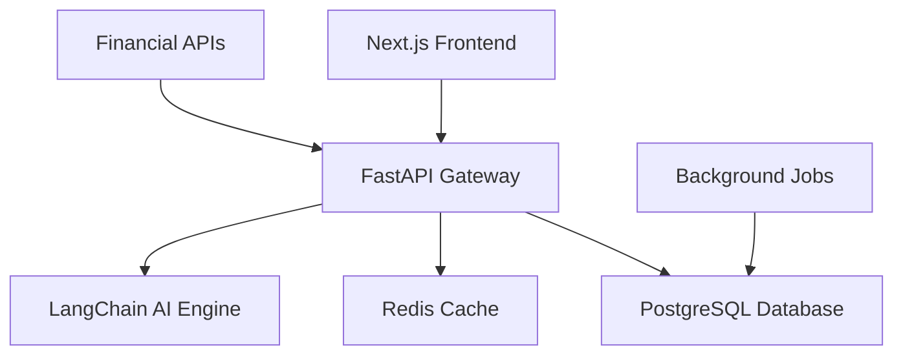

# FinAnalyzer - Financial Analysis Platform

[](https://choosealicense.com/licenses/mit/)
[](https://github.com/eyaltoledano/claude-task-master)
[](https://nextjs.org/)
[](https://fastapi.tiangolo.com/)

An AI-powered platform for automated financial data analysis and scoring.

## Project Status

✅ Initial project structure and CI/CD setup complete

## Development Progress

**Overall Progress: 4/18 tasks completed (22%)**

| ID | Task | Status | Priority | Dependencies |
|:---|:-----|:-------|:---------|:-------------|
| 1 | Setup Project Repository & CI/CD Pipeline | ✅ done | high | none |
| 2 | Design and Deploy PostgreSQL Schema | ✅ done | high | none |
| 3 | Implement Data Ingestion Adapter for FMP API | ✅ done | high | 1 |
| 4 | Scaffold Next.js Frontend with Mock Data | ✅ done | medium | 1 |
| 5 | Build FastAPI Gateway for FE/BE Communication | ⏳ pending | medium | 1, 2 |
| 6 | Implement Real-Time Data Pull and Storage | ⏳ pending | high | 2, 3 |
| 7 | Develop Hard-Coded Prompt Chain for Single Temp... | ⏳ pending | medium | 2, 3 |
| 8 | Build Scoring Module with Pydantic Validation | ⏳ pending | medium | 2, 7 |
| 9 | Display Scores & Insights in UI | ⏳ pending | medium | 4, 5, 8 |
| 10 | Add Caching for Repeat Requests | ⏳ pending | medium | 3, 6 |
| 11 | Develop JSON-Based Template Engine | ⏳ pending | medium | 2, 7 |
| 12 | Implement Responsive Layout & Filtering | ⏳ pending | medium | 4, 9 |
| 13 | Integrate Recharts for Data Visualization | ⏳ pending | medium | 4, 9 |
| 14 | Enable Report Export to PDF/CSV | ⏳ pending | medium | 9, 12 |
| 15 | Implement Bulk Screening Workflow | ⏳ pending | medium | 2, 6, 11 |
| 16 | Add Auth & Multi-Tenant Support | ⏳ pending | medium | 2, 5 |
| 17 | Implement Embeddings Store with pgvector | ⏳ pending | low | 2, 10 |
| 18 | Deploy Microservices with Kubernetes/ECS | ⏳ pending | medium | 1, 5 |


## Built with Task Master

This project uses [Task Master](https://github.com/eyaltoledano/claude-task-master) for structured development - an AI-powered project management system that breaks down complex projects into manageable tasks.

### Task Master Implementation

- **18 main tasks** broken into **101 detailed subtasks**
- AI-assisted task breakdown and complexity analysis
- Clear dependency management and execution order
- Real-time progress tracking with status updates
- Iterative development workflow

### Progress Automation Rules

To keep the progress table updated automatically:

1. **After completing any task or subtask:**

   ```bash
   # Update task status
   task-master set-status --id=<task-id> --status=done

   # Automatically update README progress table
   npm run update-progress
   ```

2. **Commit progress updates:**

   ```bash
   git add README.md .taskmaster/tasks/tasks.json
   git commit -m "progress: Complete task <id> - <task-title>"
   ```

3. **Automated script features:**

   - Reads live data from `.taskmaster/tasks/tasks.json`
   - Updates progress percentage and completion stats
   - Maintains proper status icons and formatting
   - Preserves all other README content

4. **Weekly progress sync:**
   - Review dependency blockers
   - Plan next iteration focus
   - Check for outdated task descriptions

---

## What This Does

A platform that automates financial analysis from data ingestion to scoring, designed to handle large-scale analysis efficiently.

### Core Features

**1. Automated Data Ingestion**

- Pulls financial data from APIs (Financial Modeling Prep, Yahoo Finance)
- Scheduled jobs fetch, validate, and normalize data
- Handles multiple data sources with error handling

**2. Prompt-Chain Scoring Engine**

- Uses LangChain and AI models for financial analysis
- Configurable prompt chains for different analysis types
- Consistent scoring across large datasets

**3. Template Library**

- Pre-built analysis templates for different sectors
- Customizable parameters and scoring criteria
- Reusable components for common analysis patterns

**4. Bulk Screener**

- Process 1000+ companies in parallel
- Distributed processing with Redis caching
- Async operations for performance

**5. Template Builder** _(Planned)_

- Visual interface for creating analysis workflows
- Drag-and-drop functionality for non-technical users

---

## Architecture



### Tech Stack

**Frontend**: Next.js 14, Tailwind CSS, shadcn/ui, TanStack Query  
**Backend**: FastAPI, PostgreSQL, Redis, LangChain  
**Infrastructure**: Docker, pnpm workspaces, GitHub Actions

---

## Setup

### Prerequisites

- Node.js 18+, Python 3.11+, Docker, pnpm

### Installation

```bash
git clone https://github.com/Mi-Lan/FinAnalyzer.git
cd FinAnalyzer

# Copy API key template
cp .cursor/mcp.json.example .cursor/mcp.json
# Add your API keys to .cursor/mcp.json

# Install Task Master (optional)
npm install -g task-master-ai
```

### Development with Task Master

```bash
task-master next          # See next task
task-master show 1        # Get task details
task-master list          # View all tasks

# Work on tasks
task-master set-status --id=1.1 --status=in-progress
# ... implement task ...
task-master set-status --id=1.1 --status=done
```

### Traditional Development

```bash
pnpm install
docker-compose up -d      # Start databases
pnpm dev                  # Start applications
```

---

## Development Phases

Using Task Master's structured approach:

### Phase 1: Foundation (Tasks 1-4)

- [ ] Repository setup and monorepo structure
- [ ] Database schema and migrations
- [ ] Docker containerization
- [ ] Next.js frontend with mock data

### Phase 2: Core Backend (Tasks 5-8)

- [ ] FastAPI gateway and authentication
- [ ] Data ingestion pipeline
- [ ] LangChain prompt chains
- [ ] Scoring module

### Phase 3: Integration (Tasks 9-12)

- [ ] Frontend-backend integration
- [ ] Authentication system
- [ ] Template management
- [ ] Bulk processing

### Phase 4: Enhancement (Tasks 13-18)

- [ ] Performance optimization
- [ ] Caching strategies
- [ ] Deployment automation
- [ ] Monitoring

---

## Task Master Workflow

This project demonstrates Task Master's development methodology:

**Current Stats**: 18 main tasks, 101 subtasks, real-time tracking

**Workflow**:

1. `task-master next` - Get next available task
2. `task-master show <id>` - Review implementation details
3. `task-master expand <id>` - Break down complex tasks
4. Implement code according to task specs
5. `task-master update-subtask` - Log progress
6. `task-master set-status done` - Mark completion

**Benefits**: Clear direction, manageable complexity, visible progress, AI assistance

---

## Contributing

### Task Master Users

```bash
task-master list --status=pending    # See available tasks
task-master set-status --id=<id> --status=in-progress
task-master show <id>                # Get task details
```

### Traditional Contributors

1. Fork repository
2. Check [task list](.taskmaster/tasks/tasks.json) for available work
3. Create feature branch
4. Submit pull request

---

## License

MIT License - see [LICENSE](LICENSE) file.

---

## Acknowledgments

- [Task Master](https://github.com/eyaltoledano/claude-task-master) by [@eyaltoledano](https://github.com/eyaltoledano)
- Financial Modeling Prep API
- Open source community
