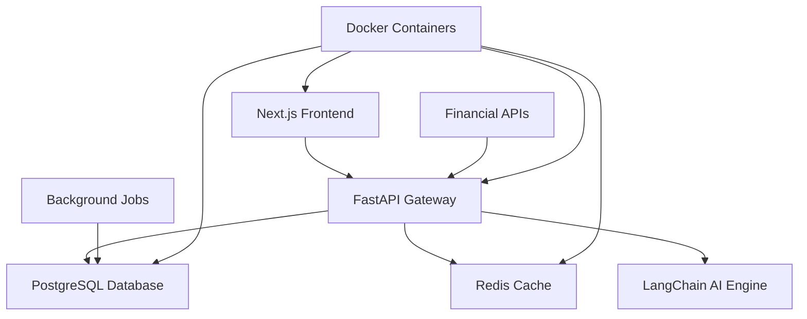

# 🚀 FinAnalyzer - AI-Powered Financial Analysis Platform

[](https://choosealicense.com/licenses/mit/)
[](https://github.com/eyaltoledano/claude-task-master)
[](https://nextjs.org/)
[](https://fastapi.tiangolo.com/)

> **🎯 Building the future of financial analysis with AI-powered automation and intelligent scoring**

---

## 🌟 **Built with Task Master AI**

This project is being developed using [**Task Master**](https://github.com/eyaltoledano/claude-task-master) - an AI-powered project management system that breaks down complex software projects into manageable, iterative tasks.

### 🔧 **Why Task Master?**
- **📋 Structured Development**: 18 main tasks broken into 86 detailed subtasks
- **🤖 AI-Assisted Planning**: Intelligent task breakdown and complexity analysis  
- **🎯 Dependency Management**: Clear task relationships and execution order
- **📊 Progress Tracking**: Real-time status updates and completion tracking
- **🔄 Iterative Workflow**: Build → Test → Learn → Iterate

**Current Progress:** [View Live Task Status](.taskmaster/tasks/tasks.json)

---

## 🎯 **What We're Building**

FinAnalyzer is an **AI-powered financial analysis platform** that automates the entire process of analyzing financial data, from ingestion to actionable insights.

### 💡 **The Problem**
- Manual financial analysis is time-consuming and error-prone
- Inconsistent scoring methodologies across analysts
- Difficulty processing large volumes of financial data
- Limited template reusability for sector-specific analysis

### 🎪 **The Solution**
A comprehensive platform with **5 core features** designed to transform financial analysis:

## 🏗️ **Core Features**

### 1. 📊 **Automated Data Ingestion**
- **What it does**: Automatically pulls financial data from APIs (Financial Modeling Prep, Yahoo Finance)
- **Why it matters**: Eliminates manual data entry and ensures real-time accuracy
- **How it works**: Scheduled jobs fetch, validate, and normalize data across multiple sources

### 2. 🧠 **Prompt-Chain Scoring Engine**
- **What it does**: Uses LangChain and AI models to analyze financial data with customizable prompts
- **Why it matters**: Provides consistent, intelligent analysis that scales across thousands of companies
- **How it works**: Configurable prompt chains process data through multiple AI reasoning steps

### 3. 📚 **Template Library**
- **What it does**: Pre-built, sector-specific analysis templates and scoring criteria
- **Why it matters**: Accelerates analysis setup and ensures industry best practices
- **How it works**: Modular templates with customizable parameters for different sectors

### 4. ⚡ **Bulk Screener**
- **What it does**: Process 1000+ companies simultaneously with parallel analysis pipelines
- **Why it matters**: Enables portfolio-level analysis and market-wide screening
- **How it works**: Distributed processing with Redis caching and async operations

### 5. 🎨 **Drag-and-Drop Template Builder** *(Future)*
- **What it does**: Visual interface for creating custom analysis workflows
- **Why it matters**: Democratizes advanced analysis creation for non-technical users
- **How it works**: React-based visual editor with real-time preview and validation

---

## 🏛️ **Architecture**



### 🛠️ **Tech Stack**

**Frontend:**
- **Next.js 14** - React framework with App Router
- **Tailwind CSS** - Utility-first styling
- **shadcn/ui** - Modern component library
- **TanStack Query** - Server state management

**Backend:**
- **FastAPI** - High-performance Python API
- **PostgreSQL** - Primary database
- **Redis** - Caching and session storage
- **LangChain** - AI prompt orchestration

**Infrastructure:**
- **Docker** - Containerization
- **pnpm Workspaces** - Monorepo management
- **GitHub Actions** - CI/CD pipeline

---

## 🚀 **Quick Start**

### Prerequisites
- Node.js 18+
- Python 3.11+
- Docker & Docker Compose
- pnpm (recommended)

### 1. **Clone & Setup**
```bash
git clone https://github.com/Mi-Lan/FinAnalyzer.git
cd FinAnalyzer

# Install Task Master globally (recommended)
npm install -g task-master-ai

# Setup API keys (copy from example)
cp .cursor/mcp.json.example .cursor/mcp.json
# Edit .cursor/mcp.json with your API keys
```

### 2. **Development with Task Master**
```bash
# Initialize project dependencies
task-master next          # See next task to work on
task-master show 1        # Get details for Task 1
task-master list          # View all tasks and progress

# Start development
task-master set-status --id=1.1 --status=in-progress
# Work on the task...
task-master set-status --id=1.1 --status=done
```

### 3. **Traditional Setup (Alternative)**
```bash
# Install dependencies
pnpm install

# Start development servers
docker-compose up -d      # Start databases
pnpm dev                  # Start all applications
```

---

## 📋 **Development Roadmap**

Our development follows a **Task Master structured approach** with clear dependencies and milestones:

### Phase 1: Foundation (Tasks 1-4)
- [x] Repository setup and monorepo structure
- [x] Database schema and migrations  
- [x] Docker containerization
- [ ] Next.js frontend with mock data

### Phase 2: Core Backend (Tasks 5-8)
- [ ] FastAPI gateway and authentication
- [ ] Real-time data ingestion pipeline
- [ ] LangChain prompt chain implementation
- [ ] AI scoring module

### Phase 3: Integration (Tasks 9-12)
- [ ] Frontend-backend integration
- [ ] User authentication system
- [ ] Template management system
- [ ] Bulk processing engine

### Phase 4: Enhancement (Tasks 13-18)
- [ ] Performance optimization
- [ ] Advanced caching strategies
- [ ] Deployment automation
- [ ] Monitoring and analytics

**🔍 Detailed Progress:** Check our [Task Master dashboard](.taskmaster/tasks/tasks.json) for real-time status updates.

---

## 🎯 **Task Master Integration**

This project showcases **Task Master** as a development methodology:

### 📊 **Current Stats**
- **18 Main Tasks** structured with clear dependencies
- **86 Detailed Subtasks** with implementation guidelines  
- **4 Complexity Levels** from simple setup to advanced AI integration
- **Real-time Progress Tracking** with status updates

### 🔄 **Development Workflow**
1. **`task-master next`** - Get next available task
2. **`task-master show <id>`** - Review implementation details
3. **`task-master expand <id>`** - Break down complex tasks
4. **Code Implementation** - Build according to task specifications
5. **`task-master update-subtask`** - Log progress and findings
6. **`task-master set-status done`** - Mark completion
7. **Repeat** - Move to next task

### 📈 **Benefits We've Experienced**
- **Clear Direction**: Always know what to work on next
- **Reduced Complexity**: Large features broken into manageable pieces
- **Better Tracking**: Real-time visibility into project progress
- **AI Assistance**: Intelligent task breakdown and suggestions

---

## 🤝 **Contributing**

We welcome contributions! This project uses **Task Master** for structured development:

### For Task Master Users:
```bash
# See available tasks
task-master list --status=pending

# Claim a task
task-master set-status --id=<task-id> --status=in-progress

# Get task details
task-master show <task-id>
```

### For Traditional Contributors:
1. Fork the repository
2. Check the [task list](.taskmaster/tasks/tasks.json) for available work
3. Create a feature branch
4. Submit a pull request

---

## 📄 **License**

This project is licensed under the MIT License - see the [LICENSE](LICENSE) file for details.

---

## 🙏 **Acknowledgments**

- **[Task Master](https://github.com/eyaltoledano/claude-task-master)** by [@eyaltoledano](https://github.com/eyaltoledano) - The AI-powered project management system that makes this structured development possible
- **Financial Modeling Prep API** - For comprehensive financial data
- **The open-source community** - For the amazing tools and frameworks

---

<div align="center">

**🚀 Built with [Task Master](https://github.com/eyaltoledano/claude-task-master) • 🤖 Powered by AI • 📊 Focused on Results**

[View Tasks](.taskmaster/tasks/tasks.json) • [Report Bug](https://github.com/Mi-Lan/FinAnalyzer/issues) • [Request Feature](https://github.com/Mi-Lan/FinAnalyzer/issues)

</div> 